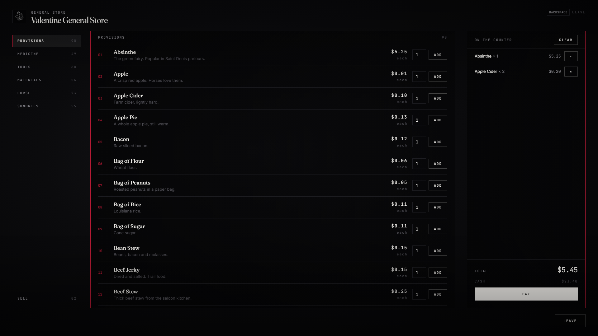

# lxr-shops — Counters for LXRCore

General stores, gunsmiths, saloons, doctors' counters, butchers and a fence.
Every shelf is a filter over the core catalog, so a new item lands on the
right shelf without touching this resource; every price is the ledger's 1899
value times the store's mark-up. Clerks stand at the counters, talking to one
through lxr-interact opens the page: shelves, a counter to pile things on,
and what the store buys from you.



## What it does

* **Shelves from the catalog** — `Config.Shelves[kind]` lists filters
  (categories, tags, names, legality, rarity cap, weapon categories); the
  server builds the shelves at boot. The fence only sells what is illegal.
* **Ledger prices** — `LXRShared.ItemValue × priceMult` per store; a night
  mark-up when `Config.Trade.openHours` is set and the counter stays open.
* **Selling** — `Config.Buys[kind]` says what a store takes; the offer is a
  share of the ledger value by quality (durability 0–100 maps onto the
  catalog's grades). Butchers and the fence are buy-heavy; saloons buy nothing.
* **Prices that move** — off by default: bought units lift the price, sold units lower it, clamped (`min`/`max`) and eased back by the hour; per store and item, persisted. `Config.Pricing`.
* **Stock** — bottomless by default; `Config.Stock.limited` gives every shelf
  line a quantity, restocks on a timer and persists in `lxr_shops_stock`.
* **One purchase, one charge** — the cart is validated line by line (shelf,
  stock, carry weight), charged once, then handed out; receipts on
  `lxr:shops:bought` / `lxr:shops:sold`.
* **Clerks** — local peds that exist only while a player is near; the
  counter is an lxr-interact target on the clerk. Blips per kind.
* **Staff counters** — `jobs = { bank = 0 }` on a store locks it to a job.
* **Themes** — LXR Night / LXR Morning from the core.

## Install

```cfg
ensure lxr-core
ensure lxr-nui
ensure lxr-inventory
ensure lxr-interact
ensure lxr-shops
```

Gunsmith repairs and parts live in lxr-weapons; treatment in lxr-doctor.

## Configuration

`config.lua` — `Config.Lang`, `Config.Trade`, `Config.Stock`,
`Config.Shelves`, `Config.Buys`, `Config.Stores`, `Config.Blips`,
`Config.Security`.

## API

| Name | Side | Purpose |
|---|---|---|
| `GetStore(id)` · `Price(item, storeId)` · `Offer(item, info, storeId)` | server | the ledger as a store sees it |
| `GetStock(storeId, item)` · `SetStock(storeId, item, n)` | server | limited stock |
| `lxr:shops:bought` (src, storeId, receipt, total) · `lxr:shops:sold` (src, storeId, line, total) | server | events |
| `Open(storeId)` · `IsOpen()` | client | open a counter from another resource |

## Building the interface

The counter is a Vite + React + TypeScript bundle. `html/` is the built
output the manifest ships (kit files, `style.css`, `app.js`); the source is
`ui/`:

```bash
cd ui && npm install && npm run build
```

`style.css` uses kit tokens only and `tools/kit_check.py` still guards it.

## Licence

© 2026 iBoss21 / LXRCore — All Rights Reserved. See `LICENSE`.
